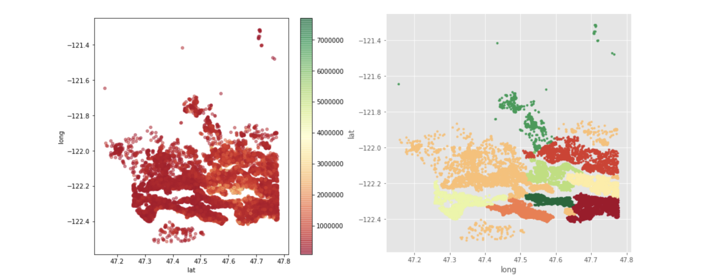
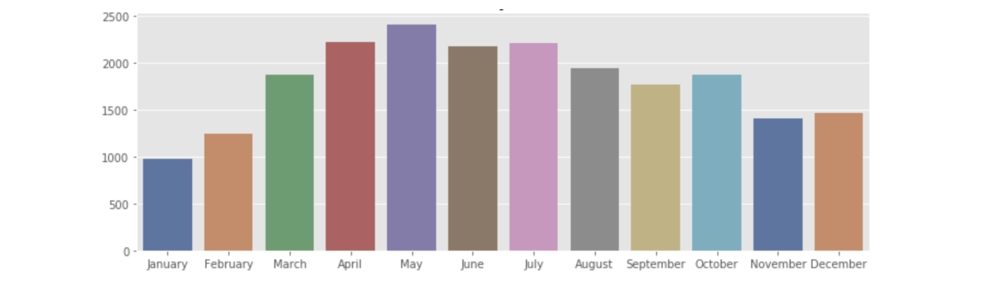
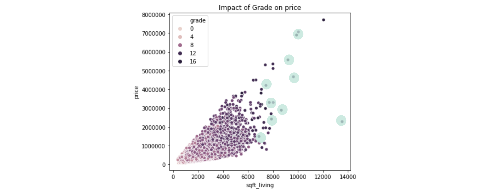
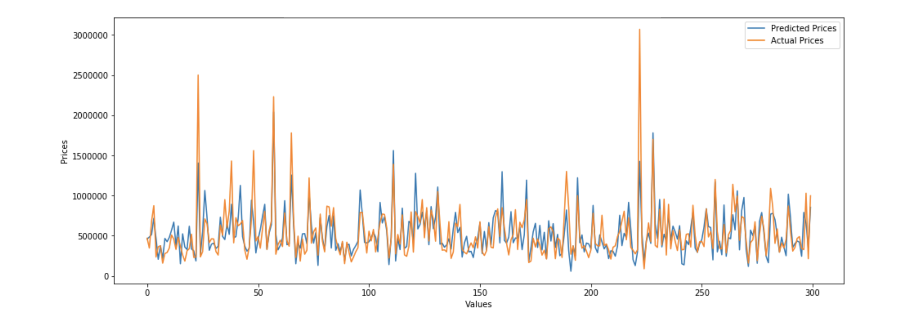
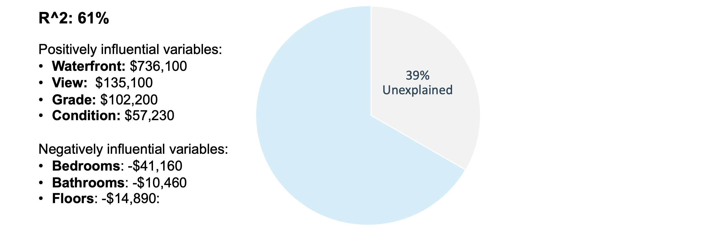

# Using Linear Regression to Predict Home Prices

### Tools Used
Python, Scikit-learn, NumPy, Pandas, Matplotlib, Seaborn

In this project I analyze the King County dataset and build a linear regression model to predict home prices. I answer three questions:
1. What parameters influence house prices the most, and how are they ranked in order of significance?
2. During what month is the supply of homes sold the greatest?
3. How can you use home grade to spot the best deals?

Below is a selection of findings:

### Price clusters are isolated according to geographic area

### Most transactions occur in May and fewest in January

### Among homes of the same price, those with higher grade and sqfoot are the best deals

### Predictions close to actuals

### Linear regression can explain 61% of the variation in price

